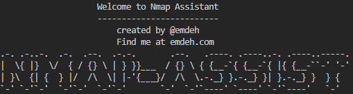

# Nmap Assistant
<div align="center">



</div>

Nmap Assistant is a tool designed to enhance cybersecurity analysis by integrating the capabilities of OpenAI to help analyse results and suggest next steps.

It is particuarly useful for those new to Nmap, who might need help intepreting output.

# Features

- Parses Nmap scan results from XML output.
- Utilises OpenAI to analyze scan data and provide cybersecurity recommendations.
- Interactive command-line interface for a user-friendly experience.
- Customizable queries for diverse cybersecurity scenarios.

# Prerequisites
Before you start using Nmap Assistant, ensure you have the following:

- Python 3.x installed.
- Access to OpenAI API (API key required).
- Nmap installed and familiar with running scans and exporting results in XML format.

# Installation
Clone the repository or download the source code:

```bash
git clone https://github.com/yourusername/nmap-assistant.git
cd nmap-assistant
```

## (Optional) Set up a virtual environment:

```bash
python -m venv venv
source venv/bin/activate  # On Windows use `venv\Scripts\activate`
```

## Install required dependencies:

```bash
pip install -r requirements.txt
```

# Usage

## Running a Scan
Perform an Nmap scan as you normally would and export the results in XML format:

```bash
nmap -oX output.xml [scan options] [target]
```

## Run setup.py

Run the setup script and follow the on-screen instructions to provide you `OPEN API key` and the path to the `XML file` when prompted.

```bash
python setup.py


                    Welcome to Nmap Assistant
                    -------------------------
                        created by @emdeh
                        Find me at emdeh.com
.-. .-..-.  .-.  .--.  .-.-.       .--.   .----. .----..-. .----..-----. 
|  \{ |}  \/  { / {} \ | } }}___  / {} \ { {__-`{ {__-`{ |{ {__-``-' '-' 
| }\  {| {  } |/  /\  \| |-'{___}/  /\  \.-._} }.-._} }| }.-._} }  } {   
`-' `-'`-'  `-'`-'  `-'`-'       `-'  `-'`----' `----' `-'`----'   `-'   
    
Please enter your OpenAI API key: <SNIP>
Please enter the path to your Nmap output XML file:    <SNIP>

The data from the provided Nmap scan has been passed to OpenAI. Please wait for recommendations...


Summary:
Host 1 (192.168.86.20): 6 ports open, 6 services identified
Host 2 (192.168.86.26): 1 port open, 1 service identified

For host 1 (192.168.86.20): I recommend using manual and automated tools to further assess the ports and services identified, such as Nessus and Nmap scripts. I also suggest using Metasploit to attempt to gain access to the system via the identified services.

For host 2 (192.168.86.26): I recommend further assessing the open port 6668, as it might provide access to the system via the Internet Relay Chat (IRC) protocol. Additionally, I suggest using Metasploit to attempt to gain access to the system via the IRC port.

Do you have any other cybersecurity questions? (yes/no): 
yes 

Follow-up question:
what is 6668 typically used for?

Response to your question:

6668 is typically used as the default port for reverse proxy traffic, which is used for improving the performance of web servers.
```

# Interpreting Results
The tool will display AI-powered analysis and recommendations based on the Nmap scan data.

## Additional example
```bash
python setup.py


                    Welcome to Nmap Assistant
                    -------------------------
                        created by @emdeh
                        Find me at emdeh.com
.-. .-..-.  .-.  .--.  .-.-.       .--.   .----. .----..-. .----..-----. 
|  \{ |}  \/  { / {} \ | } }}___  / {} \ { {__-`{ {__-`{ |{ {__-``-' '-' 
| }\  {| {  } |/  /\  \| |-'{___}/  /\  \.-._} }.-._} }| }.-._} }  } {   
`-' `-'`-'  `-'`-'  `-'`-'       `-'  `-'`----' `----' `-'`----'   `-'   
    
Please enter your OpenAI API key: <SNIP>
Please enter the path to your Nmap output XML file:    <SNIP>

The data from the provided Nmap scan has been passed to OpenAI. Please wait for recommendations...

Summary:
Two hosts were found, each with different services running on different ports. Host 192.168.86.20 had 7 ports open, running http, ajp13, https-alt, cslistener, scp-config, and rxapi services. Host 192.168.86.26 had 1 port open, running irc service.

For host 192.168.86.20, I recommend checking for open web directories, implementing general security measures such as patching and configuring firewall rules, validating security configurations, and running penetration tests on the http server and the applications.

For host 192.168.86.26, I recommend restricting access to the IRC service to ensure only authorised users can connect and also checking that any necessary security measures have been implemented. Additionally, services such as SSH or HTTP should be scanned to check for any potential vulnerabilities.

Do you need help crafting further scan commands? (yes/no): 
yes
Suggested Nmap Command:

The Nmap command for these two hosts would be: nmap -p 80,8008,8009,8443,9000,10001,10010,6668 -sV 192.168.86.20 192.168.86.26

Do you have any other cybersecurity questions? (yes/no): 
no
No further questions. Exiting the program. Have a great day!
```

# Contributing
Contributions to Nmap Assistant are welcome! Feel free to fork the repository, make your changes, and submit a pull request.