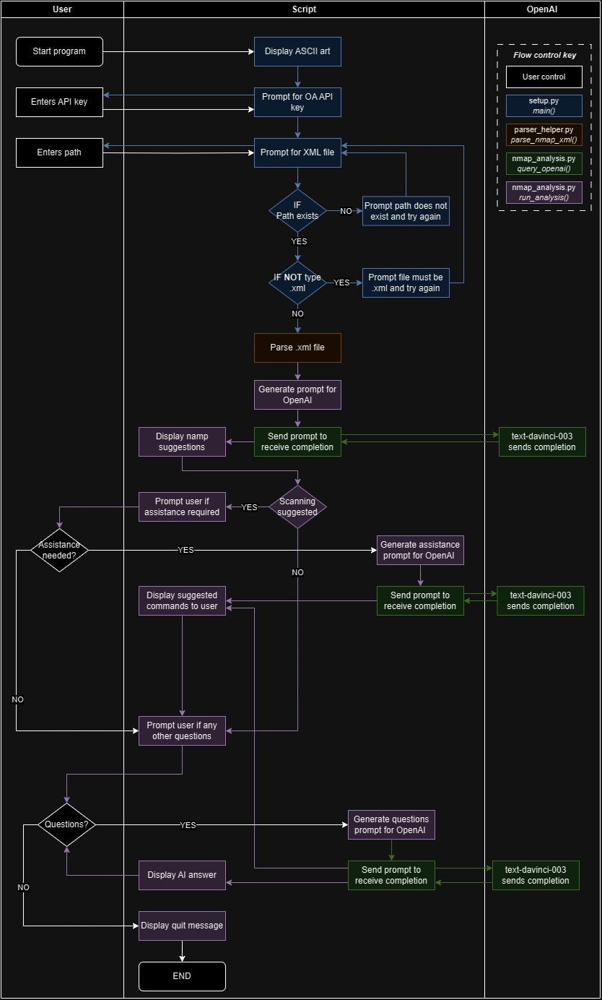

# Nmap Assistant - Technical Documentation

This document provides a technical overview of the project, explaining its structure, components, and usage.

## Overview
Nmap Assistant is a Python-based tool that integrates OpenAI's powerful AI capabilities with network scanning results from Nmap. It parses the XML output of Nmap scans, sends this data to OpenAI's API, and retrieves AI-driven insights and recommendations. This document serves as a technical guide for developers.

# Project Structure

```bash

nmap-assistant/
│
├── nmap_analysis.py       - Main module for analysis and OpenAI integration.
├── setup.py               - Script for initial setup and user interaction.
├── parser_helper.py       - Module for parsing Nmap XML output.
└── requirements.txt       - Required Python libraries.
```
# Diagram
<p align="center">



</p>

## nmap_analysis.py

**Purpose:** Handles the integration with OpenAI and processes Nmap scan data.

**Functions:**
- `query_openai(prompt)`: Makes API calls to OpenAI and returns the response.
- `run_analysis(api_key, xml_file_path)`: Orchestrates the parsing of Nmap data and queries OpenAI.

## setup.py

**Purpose:** Entry point for the user. Handles gathering user inputs (API key and XML file path) and initiates the analysis process.

**Main Functions:**
- `get_openai_api_key()`: Prompts user for OpenAI API key.
- `get_xml_file_path()`: Prompts user for the path to the Nmap output XML file.
- `main()`: Main function to execute the script.

## parser_helper.py
**Purpose:** Contains utility function(s) for parsing Nmap's XML output.

**Functions:**
- `parse_nmap_xml(file_path)`: Parses XML and returns structured data.

Other dependencies are listed in requirements.txt.

# Dependencies
- Python 3.x installed.
- Access to OpenAI API (API key required).
- Nmap installed and familiar with running scans and exporting results in XML format.

## Setup and Configuration

1. **Environment Setup:**

> It's recommended to use a virtual environment.

```bash
python -m venv venv
source venv/bin/activate  # Use venv\Scripts\activate on Windows
```

2. **Install Dependencies:**


```bash
pip install -r requirements.txt
```

3. **API Key Configuration:** 

The OpenAI API key must be set as an environment variable OPENAI_API_KEY or passed directly to the run_analysis function.

>*This isn't actually true. It's already passed as a function variable but also an environment variable.*


# Usage
To run the tool, execute setup.py and follow the on-screen prompts:

```bash
python setup.py
```

# Error Handling
- OpenAI API Errors: Handled in query_openai within nmap_analysis.py.
- XML Parsing Errors: Handled in parse_nmap_xml within parser_helper.py.
- User Input Errors: Validations in setup.py.

# Testing
- Test Scripts: Additional test scripts can be created to test individual modules.
Testing Framework: Python unittest framework is recommended for writing test cases.

# User documentation
- [User documentation](README.md)

# Contributing
Contributions should follow the established code structure and styling guidelines. Please ensure that all pull requests are accompanied by corresponding tests.